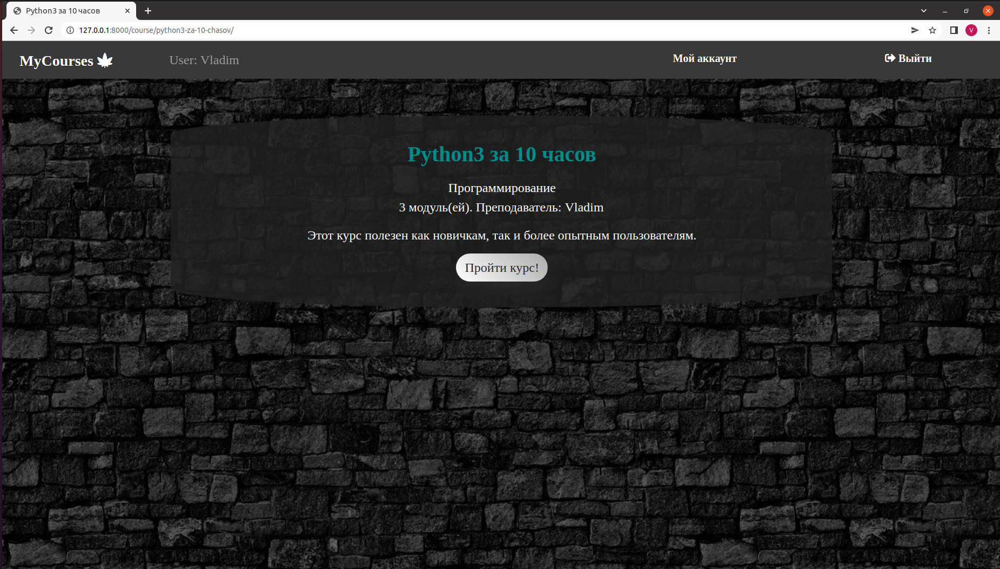

# ISP_Lab3-4
Краткое описание: сайт курсов **"MyCourses"**.
Данный сайт предназначен для прохождения курсов.

Для того, чтобы пройти курс, сначала пользователю необходимо зарегистрироваться (неавторизованный пользователь может лишь просмотреть перечень предоставляемых курсов). 

Во время регистрации,

пользователь может выбрать флаг "*Преподаватель*", чтобы создавать свои курсы по выбранным предметам. 

Если пользователь зарегистрирован, то необходимо войти в систему.

Если пользователь забыл пароль, 

то можно воспользоваться опцией "*Забыли пароль?*" и пройти все этапы по восстановлению:
* Ввести адрес электронной почти, которую использовали при регистрации

* Получить сообщение с инструкциями по восстановлению пароля

* Перейти по ссылке и ввести новый пароль. 

Теперь можно войти в систему на свой аккаунт с курсами.

Пользователь без флага "Преподаватель" может только проходить курсы. 

Преподаватель может создавать, изменять и удалять свой курс.

* При редактировании преподаватель может поменять название, предмет и описание курса.

* Также может удалить свой курс.

* При редактировании он может добавлять контент для курса.

В следствии, пользователю предоставляется курс, который он может пройти.

[Link to heroku project](https://herokuapplab3isp.herokuapp.com/)
[Docker link](https://hub.docker.com/repository/docker/nikaapots/lab4isp)